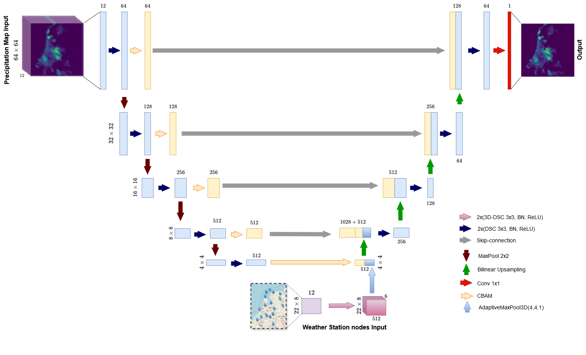
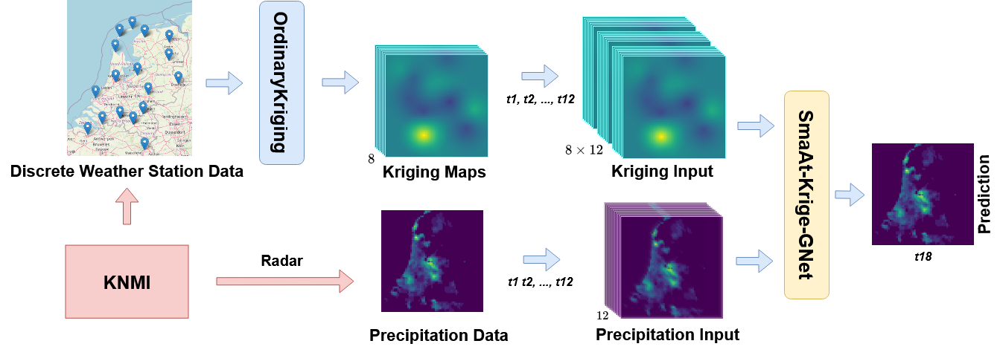
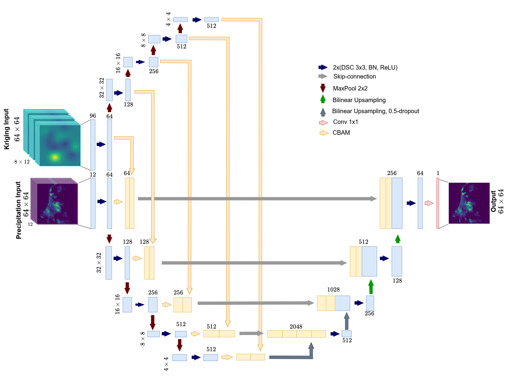
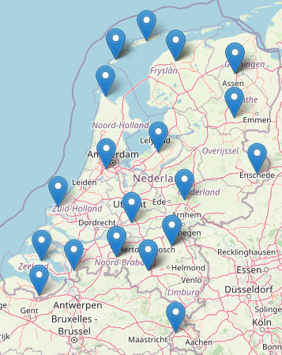

# SmaAt-fUsion and SmaAt-Krige-GNet
Code for the Paper "Integrating Weather Station Data and Radar for Precipitation Nowcasting: SmaAt-fUsion and SmaAt-Krige-GNet" [Arxiv-link](https://arxiv.org/abs/2502.16116)




The proposed models can be found in the model-folder under [models](models/unet_precip_regression_lightning.py).


## Installing dependencies
run pip install -r requirements.txt

Basically, only the following requirements are needed:
```
tqdm
torch
lightning
tensorboard
torchsummary
h5py
numpy
PyKrige
```


---
If any requirements are still missing, install them using pip.
For the paper we used the [Lightning](https://github.com/Lightning-AI/lightning) -module (PL) which simplifies the training process and allows easy additions of loggers and checkpoint creations.
In order to use PL we created the model [UNetDS_Attention](models/unet_precip_regression_lightning.py) whose parent inherits from the pl.LightningModule. This model is the same as the pure PyTorch SmaAt-UNet implementation with the added PL functions.

### Training
For training on the precipitation task we used the [train_models.py](train_models.py) file. 

To train SmaAt-fUsion please choose 'Node_SmaAt_bridge' in [train_models.py](train_models.py).

To train SmaAt-Krige-GNet please choose 'Krige_GNet' in [train_models.py](train_models.py).

To train SmaAt-Unet use [train_smaat.py](train_smaat.py).

The training will place a checkpoint file for every model in the `default_save_path` `lightning/precip_regression`.

After finishing training place the best models (probably the ones with the lowest validation loss) that you want to compare in another folder in `checkpoints/comparison`.

### Testing
The script [test_models.py](test_models.py) will test the models placed in `checkpoints/comparison` to calculate the MSEs and other metrics such as F1, CSI, HSS, MCC.
The results will get saved in a json in the same folder as the models.
Specify the model you want to train in the console by adding it as an argument to '--m'.
For example:
```
test the SmaAt-Unet models, test_models.py --m "Smaat"
```
```
test the SmaAt-fUsion, test_models.py --m "Bridge"
```
```
test the SmaAt-Krige-GNet, test_models.py --m "Krige"
```
```
To test the persistence model, set the argument '--p' to True.
```
```
test_models.py --m "Smaat" --p True
```

### Precipitation dataset
This study utilizes two complementary datasets: a weather station dataset and a radar-based precipitation dataset from Jan 2016 to Dec 2019. Both datasets were obtained from the [The Royal Netherlands Meteorological Institute (KNMI)](https://www.knmi.nl/over-het-knmi/about).

The weather station dataset which provides multivariable atmospheric measurements from 22 weather stations across the Netherlands. 
Overview map of all the nodes that are included in the weather station dataset can be seen below : (Some of stations share identical coordinates. The key difference lies in their purpose or operational context, often reflecting distinct monitoring objectives, equipment, or affiliations. So in the following maps there are only 17 nodes)



The 4 year radar-based precipitation dataset consists of precipitation maps in 5-minute intervals from 2016-2019 resulting in about 420,000 images. The precipitation dataset originally used by Trebing et al. 
The dataset is based on radar precipitation maps.
The original images were cropped as can be seen in the example below:


If you are interested in the dataset that we used please write an e-mail to: s.mehrkanoon@uu.nl

Use the [create_dataset.py](create_datasets.py) to create the dataset from the original dataset.

The dataset is already normalized using a [Min-Max normalization](https://en.wikipedia.org/wiki/Feature_scaling#Rescaling_(min-max_normalization)).
In order to revert this you need to multiply the images by 47.83; this results in the images showing the mm/5min.

For the SmaAt-fUsion model to work, the node dataset needs to be synced and merged with the precipitation dataset using the functions in dataset_utils.

For the SmaAt-Krige-GNet model to work, the Kriging dataset needs to be generated from a synced and merged dataset using [create_kriging_datasets.py](create_kriging_datasets.py)

Citation
```
@misc{cornelissen2025integratingweatherstationdata,
      title={Integrating Weather Station Data and Radar for Precipitation Nowcasting: SmaAt-fUsion and SmaAt-Krige-GNet}, 
      author={Aleksej Cornelissen and Jie Shi and Siamak Mehrkanoon},
      year={2025},
      eprint={2502.16116},
      archivePrefix={arXiv},
      primaryClass={cs.LG},
      url={https://arxiv.org/abs/2502.16116}, 
}
```

